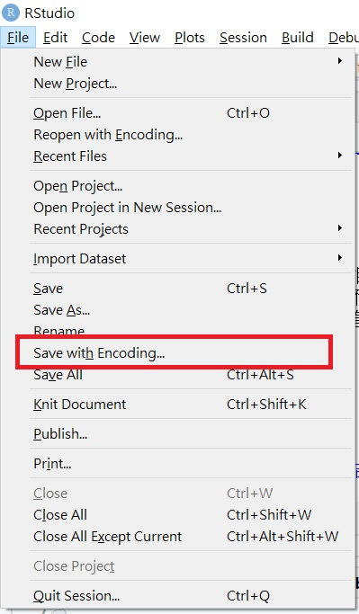
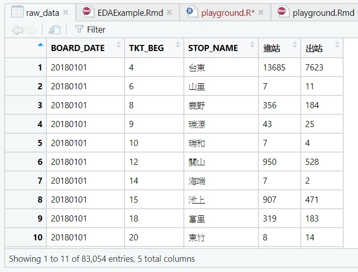

```{r setup, include=FALSE}
knitr::opts_chunk$set(echo = TRUE)
```

<hr />

## Introduction

這份文件會簡單走一遍 EDA 的流程，並根據我們在作業一看到的問題給一些小建議，我們示範的 dataset 是來自政府資料開放平台的 **[火車每日各站點進出站人數](https://data.gov.tw/dataset/8792)** 。

EDA 的目標是要對資料有更進一步的認識，除了最基本的**理解資料框各欄位的意義**，我們還可以利用簡單的視覺化**觀察各欄位資料的分布**，再來進一步分析**各變數是否有潛在的相關性**。

## Code

### 第一步: 讀取資料

大家取得資料集的來源不盡相同，尤其有些人的資料集內可能會有中文資料，然而 R 對於非英文資料的處理有些不友善，這邊提供一個原則性的方法來預處理並讀取資料，基本上可以解決大多狀況。如果只是純英文資料可以直接進入讀取的部分。

1. 確保資料編碼(encoding)儲存為 utf8(UTF-8)

    可以直接使用 RStudio 開啟原始的 csv 檔，然後左上角選 Save with Encoding... -> UTF-8。
    ```{r, out.width= "200px", echo=FALSE}
    
    ```

2. 使用 **readr** 套件裡的 **read_csv**，可以解決原生的 **read.csv** 會遇到的許多莫名其妙的問題。
    ```{r}
    library(readr)
    raw_data <- read_csv("每日各站進出站人數2018.csv")
    ```
    
    如果不想只為了使用一次而引入整個套件，可以改成
    
    ```{r, eval=F}
    raw_data <- readr::read_csv("每日各站進出站人數2018.csv")
    ```


### 第二步: 初步認識資料結構

通常在下載資料的網站都會有介紹各個欄位所代表的意義，我們仍然可以使用 str, head, View 等函數來觀察我們讀進來的資料。

- **str** 會提供資料行列數，並簡介資料內的各個 column ，包含名稱、變數型別(數字、文字)。
    ```{r}
    str(raw_data)
    ```
    這裡可以看到我們的資料一共有5個欄位、83054筆紀錄，其中四個欄位是數值，一個欄位是文字。  
    另外從資料來源網站可以看到每個欄位分別代表
    - **BOARD_DATE**: 該筆資料日期
    - **TKT_BEG**: 該筆資料代表車站的編號
    - **STOP_NAME**: 該筆資料代表車站的站名
    - **進站**: 該日該車站的進站人數
    - **出站**: 該日該車站的出站人數
    
- **head** 會取出資料的前六列，讓你可以快速瀏覽資料框的樣子，避免把整個太大的資料框全部顯示出來
    ```{r}
    head(raw_data)
    ```
    也可以多加一個參數指定要取出前幾行
    ```{r}
    head(raw_data, 10)
    ```
    或是使用 **tail** 觀察最後幾行
    ```{r}
    tail(raw_data)
    ```

- **View** 通常不會使用在 Rmd，而是我們在寫 RScript 的時候可以打開一個新視窗來用表格的型式檢視資料框。
    ```{r, eval=F}
    View(raw_data)
    ```
    ```{r, out.width= "300px", echo=FALSE}
    
    ```

### 第三步: 找出有興趣或有潛在關係的變數畫圖觀察(同時根據我們想要做到的目標整理一下資料框)

在了解每個欄位所代表的意義後，我們便可以嘗試視覺化一些結果
先引入一些重要的套件:
```{r, message=F, warning=F}
library(dplyr)
library(tidyr)
library(ggplot2)
```

#### 簡單的處理
1. 重新命名各欄位
    ```{r}
    data <- raw_data %>%
        rename(Date=BOARD_DATE, StopID=TKT_BEG, StopName=STOP_NAME, In="進站", Out="出站")
    
    head(data)
    ```


2. 將日期分割成年月日三個欄位。  
    (利用 **select(-Date)** 可以移除 Date 這個 column)  
    (這份資料的日期是很乾淨的8位數字，因此可以用一些簡單的數學計算找出年月日，如果需要更進階的日期處理，可以學習 [lubridate](https://github.com/rstudio/cheatsheets/raw/master/lubridate.pdf) 這個套件)
    ```{r}
    data <- data %>%
        mutate(year=Date%/%10000, month=(Date%/%100)%%100, day=Date%%100) %>%
        select(-Date)
    
    head(data)
    ```

3. 我們可以利用 **group_by(StopID)** 先挑選出總流量最大的幾個大站並繪圖
    ```{r}
    data_by_stop <- data %>%
        group_by(StopID, StopName) %>%
        summarise(In=sum(In), Out=sum(Out)) %>%
        ungroup

    top10Stops <-  top_n(data_by_stop, 10, In)$StopName
    top10Stops
    
    data_by_stop %>%
        filter(StopName %in% top10Stops) %>%
        gather("InOut", "count", In:Out) %>%
        ggplot(aes(x=StopName, y=count, fill=InOut)) + 
        geom_bar(stat="identity", position="dodge") + 
        ggtitle("前十大車站流量長條圖")
    
    
    ```


4. 接下來也可以利用 **groupt_by(month)** 來看每個月的旅客流量
    ```{r}
    data_by_month <- data %>%
        group_by(month, StopName) %>%
        summarise(In=sum(In), Out=sum(Out)) %>%
        ungroup

    data_by_month %>%
        filter(StopName %in% top10Stops) %>%
        ggplot(aes(x=month, y=In, color=StopName)) + 
        geom_line() + 
        ggtitle("2018年前十大車站各月流量(進站)折線圖") +
        scale_x_continuous(breaks=1:12)
    ```

到這邊為止，我們已經利用簡單的視覺化對資料有了基本的認識。

### EDA 之後...

透過以上的簡單資料處理及視覺化，我們已經對資料集有一些初步認識，這時候你可能對這份資料有一些猜測，例如：哪些月份流量特別大?為什麼? 為了解決這些問題我們可能需要找到更多的資料來做參考，並利用一些統計的方式來驗證自己的假設。  
在第一、二份作業，我們希望大家加強處理資料和利用視覺化來做 EDA 的能力，來從各式各樣的資料集中找出潛在的各種分析方向。